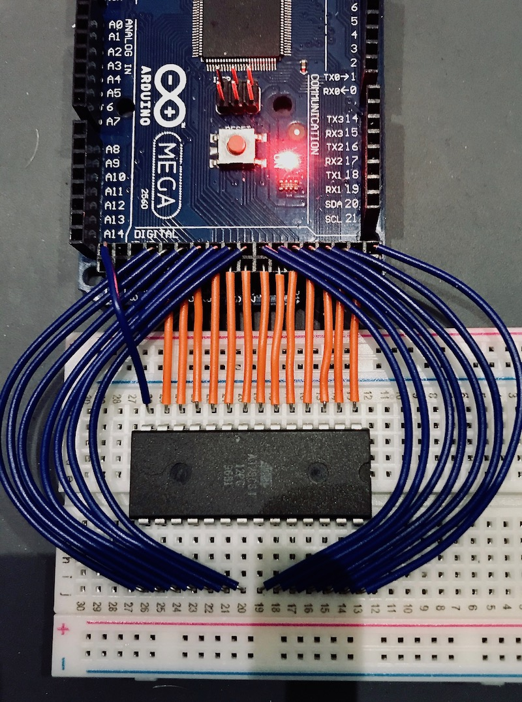

# EEPROMAdapter

This adapter can read and write AT28C64 and AT28C256 EEPROM chips. Creating converter PCB for this task recommended

## Table of content

- [EEPROMAdapter](#eepromadapter)
  - [Table of content](#table-of-content)
  - [How to connect your arduino](#how-to-connect-your-arduino)
    - [PIN layout](#pin-layout)
    - [Example](#example)
  - [Usage](#usage)
    - [EEPROMAdapter](#eepromadapter-1)
      - [Constructor:](#constructor)
      - [void init():](#void-init)
      - [uint8_t readChip(uint16_t address);](#uint8t-readchipuint16t-address)
      - [void writeChip(uint16_t address, uint8_t data)](#void-writechipuint16t-address-uint8t-data)
    - [EEPROMSerial](#eepromserial)
      - [Constructor:](#constructor-1)
      - [void checkAndExecute():](#void-checkandexecute)

## How to connect your arduino

This library is made for the arduino mega microcontroller, because thats the most common and cheap solution. For other device there is no remapping option, yet.

### PIN layout

Default arduino mega pin layout

```c
 /*
    Arduino Mega 2560 Pin layout

    23 RDY		VCC
    25 A12  	24 WE
    27 A7 	 	26 NC
    29 A6 		28 A8
    31 A5 		30 A9
    33 A4 		32 A11
    35 A3 		34 OE
    37 A2 		36 A10
    39 A1 		38 CE
    41 A0 		40 IO7
    43 IO0 		42 IO6
    45 IO1 		44 IO5
    47 IO2		46 IO4
    GND			48 IO3
*/
```

### Example

The following picture shows a working connection with an arduino mega microcontroller:



## Usage

You can use the code in the src/main.cpp file directly to control your adapter via Serial port or just using the EEPROMAdapter class in a different way.

### EEPROMAdapter

This is the low level adapter, which can read and write data directly from/to the given address. You can run these operations one by one. If you need automatisation or more controlled handling, please check the EEPROMSerial class, which allows you to control your commands via serial port. (or any stream compatible way)

#### Constructor:

It doesn't have any input parameters and it won't initialise the adapter for you. You have to call the init function manualy when it's appropiate.

#### void init():

You must call this method, before you start using the adapter. (you also need to do it before you bass it to the EEPROMSerial instance) It will initialize your pins and sets the initial states.

#### uint8_t readChip(uint16_t address);

This method reads the value of the memory block on the given address. The maximum address depends on the chip itself. If you give a bigger number, then the script will chop of the higher bits. If you have the smaller memory chip, then it will set those pins also, but most of these overlapping pins are status pins or not connected. (for further details, please check the Atmel datasheets)

#### void writeChip(uint16_t address, uint8_t data)

This methods will update your chip's memory block on the givcen address. These chips are all having 8 bit's data blocks, so your data must be below 128. If you give a higher number, then the code will chop of the extra bits, so be cautious. The maximum address depends on the chip itself. If you give a bigger number, then the script will also chop of the higher bits.

### EEPROMSerial

This is a helper function, which is using the EEPROMAdapter to read or write to your memory via serial port.

#### Constructor:

You can provide a Serial input, output stream and an adapter instance. If the in/out stream is the same, then you can use the simplified constructor to provide for both the same stream handler.

#### void checkAndExecute():

It starts to listen to the provided stream output and when data is comming, it parse and executes the commands. The following commands are available:

- Read: You can read a memory address with this command. Syntax: rAAAAA, where r is the read flag and AAAAA is the address. Example: r00000 will read the first memory address.
- Write: You can write to the given memory address with this method. Syntax: wAAAAADDD, where w is the read flag and AAAAA is the address, DDD is the value. Example: w00000128 will write all ones to the first memory address.

The maximum address is depends on the EEPROM-s capacity, the value's limit is 127. (because these chips are storing data on 8 bit) All the numbers are decimals and the adapter will convert them into binary values. Flags are case insensitive. (r/R or w/W)
