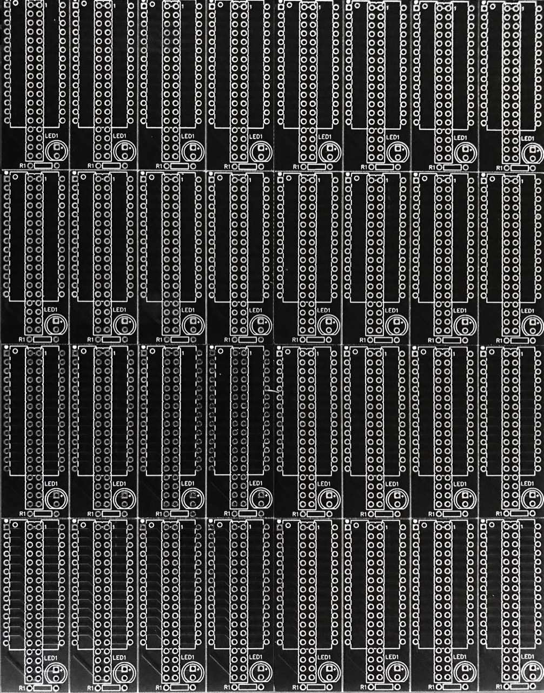
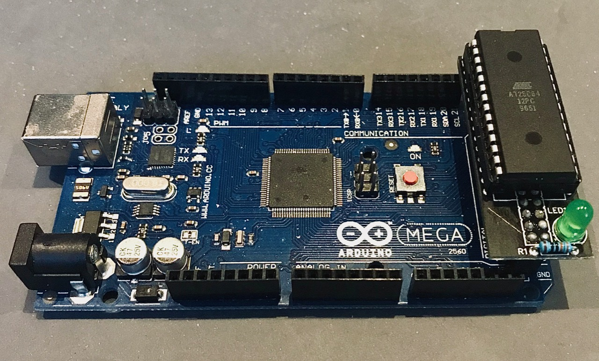

# EEPROMAdapter

This adapter can read and write AT28C64 and AT28C256 EEPROM chips using Arudino Mega. Creating converter PCB for this task recommended, but not mandatory. (see below for details)

## Table of content

- [EEPROMAdapter](#eepromadapter)
  - [Table of content](#table-of-content)
  - [How to connect your arduino](#how-to-connect-your-arduino)
    - [PIN layout](#pin-layout)
    - [PCB](#pcb)
      - [Manufactured PCBs](#manufactured-pcbs)
      - [Assembled Adapter](#assembled-adapter)
  - [Usage](#usage)
    - [EEPROMAdapter](#eepromadapter-1)
      - [Constructor:](#constructor)
      - [void init():](#void-init)
      - [uint8_t readChip(uint16_t address);](#uint8t-readchipuint16t-address)
      - [void writeChip(uint16_t address, uint8_t data)](#void-writechipuint16t-address-uint8t-data)
    - [EEPROMSerial](#eepromserial)
      - [Constructor:](#constructor-1)
      - [void checkAndExecute():](#void-checkandexecute)

## How to connect your arduino

This library is made for the arduino mega microcontroller, because thats the most common and cheapest solution. For other device there is no remapping options, yet. We will use the double row pin heads at the middle of the mega (pin 22-53)

### PIN layout

Default arduino mega pin layout

```c
 /*
    Arduino Mega 2560 Pin layout

    22 RDY		VCC
    24 A12  	23 WE
    26 A7 	 	25 NC
    28 A6 		27 A8
    30 A5 		29 A9
    32 A4 		31 A11
    34 A3 		33 OE
    36 A2 		35 A10
    38 A1 		37 CE
    40 A0 		39 IO7
    42 IO0 		41 IO6
    44 IO1 		43 IO5
    46 IO2		45 IO4
    GND 		  47 IO3
              53 INDICATOR_PIN
*/
```

### PCB

You can order a working PCB using the generated gerber [file](./files/Gerber_PCB.zip) or do it yourself at home using [this](./files/Single_Side_PCB.svg) one sided svg image.

#### Manufactured PCBs



#### Assembled Adapter



## Usage

Check the example files provided by this library. The adapter can read and write from/to your AT28 chip and the serial library can control the adapter via serial port commands.

### EEPROMAdapter

This is a low level adapter, which can read and write data directly from/to the given address. You can run these operations one by one. No need for delay, the library will take care of it. If you need automatisation or more controlled handling, please check the EEPROMSerial class, which allows you to control your commands via serial port. (or any stream compatible way)

#### Constructor:

It doesn't have any input parameters and it won't initialise the adapter for you. You have to call the init function manualy when it's appropiate to set up the IC pins.

#### void init():

You must call this method, before you start using the adapter. (you also need to do it before you pass it to the EEPROMSerial instance) It will initialize your pins and sets the initial states of your IC.

#### uint8_t readChip(uint16_t address);

This method reads the value of the memory block on the given address which is a decimal number. The maximum address depends on the chip itself. If you give a bigger number, then the script will chop of the higher bits. If you have the smaller memory chip, then it will set those pins also, but most of these overlapping pins are status pins or not connected on the smaller one. (for further details, please check the Atmel datasheets)

Example:

```C
uint16_t address = 1001;
uint8_t value = adapter.read(address);

Serial.print("Address: ");
Serial.print(address);
Serial.print(" Value: ");
Serial.println(value);
```

#### void writeChip(uint16_t address, uint8_t data)

This methods will update your chip's memory block on the given address. These chips are all having 8 bit long data blocks, so your input data must be below 256. If you give a higher number, then the code will chop of the extra bits, so be cautious. The maximum writable address depends on the chip itself. If you give a bigger number, then the script will also chop of the higher bits.

Example:

```C
uint16_t address = 1001;
uint8_t value = 200;

adapter.write(address, value);
```

### EEPROMSerial

This is a helper object, which is using the EEPROMAdapter to read or write to your memory via serial port commands.

#### Constructor:

You can provide a Serial input, output stream and an adapter instance. If the in/out stream is the same, then you can use the simplified constructor to provide for both the same stream handler.

#### void checkAndExecute():

It starts to listen to the provided stream output and it parse and executes the commands which is received on the serial port. The following commands are available:

- Read: You can read a memory address with this command. Syntax: rAAAAA, where r is the read flag and AAAAA is the address. Example: ```r00000``` will read the first memory address.
- Write: You can write to the given memory address with this method. Syntax: wAAAAADDD, where w is the write flag and AAAAA is the address, DDD is the value. Example: ```w00000255``` will write all ones to the first memory address.

The maximum address is depends on the EEPROM-s capacity, but the block size is always 8 bit, so the maximum value is 255 on a single block. All the input numbers are decimals and the adapter will convert them into binary values. Flags are case insensitive. (both r/R and w/W can be used to send commands to the listener)
